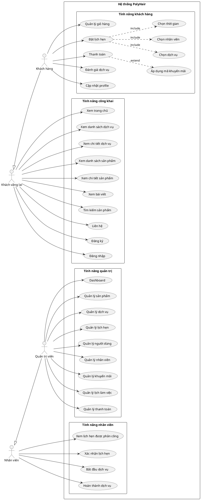

# Sơ đồ Use Case - PolyHair Barbershop

## 📋 Tổng quan hệ thống
PolyHair là hệ thống quản lý tiệm cắt tóc trực tuyến, cho phép khách hàng đặt lịch hẹn, mua sản phẩm và quản lý dịch vụ làm đẹp.

---

## 👥 Các Actor (Người dùng)

### 1. **Guest (Khách vãng lai)**
- Người dùng chưa đăng nhập vào hệ thống

### 2. **Customer (Khách hàng đã đăng ký)**
- Người dùng đã có tài khoản và đăng nhập vào hệ thống

### 3. **Employee (Nhân viên/Thợ cắt tóc)**
- Nhân viên làm việc tại tiệm, thực hiện dịch vụ cho khách

### 4. **Admin (Quản trị viên)**
- Người quản lý toàn bộ hệ thống

---

## 📊 Sơ đồ Use Case - Text-based Diagram

```
┌─────────────────────────────────────────────────────────────────────────────────┐
│                              POLYHAIR BARBERSHOP SYSTEM                         │
├─────────────────────────────────────────────────────────────────────────────────┤
│                                                                                 │
│  ┌─────────┐                                                    ┌─────────┐    │
│  │  GUEST  │                                                    │  ADMIN  │    │
│  └────┬────┘                                                    └────┬────┘    │
│       │                                                              │         │
│       ├──► UC01: Xem trang chủ                                       │         │
│       ├──► UC02: Xem danh sách dịch vụ                               │         │
│       ├──► UC03: Xem chi tiết dịch vụ                                │         │
│       ├──► UC04: Xem danh sách sản phẩm                              │         │
│       ├──► UC05: Xem chi tiết sản phẩm                               │         │
│       ├──► UC06: Xem bài viết (Blog)                                 │         │
│       ├──► UC07: Tìm kiếm sản phẩm                                   │         │
│       ├──► UC08: Tìm kiếm blog                                       │         │
│       ├──► UC09: Liên hệ                                             │         │
│       ├──► UC10: Đăng ký tài khoản                                   │         │
│       └──► UC11: Đăng nhập                                           │         │
│                                                                      │         │
│  ┌──────────┐                                                        │         │
│  │ CUSTOMER │                                                        │         │
│  └────┬─────┘                                                        │         │
│       │                                                              │         │
│       ├──► UC12: Thêm sản phẩm vào giỏ hàng                         │         │
│       ├──► UC13: Quản lý giỏ hàng                                    │         │
│       ├──► UC14: Đặt lịch hẹn                                        │         │
│       ├──► UC15: Chọn dịch vụ cho lịch hẹn                          │         │
│       ├──► UC16: Chọn nhân viên                                      │         │
│       ├──► UC17: Chọn thời gian                                      │         │
│       ├──► UC18: Thanh toán                                          │         │
│       ├──► UC19: Áp dụng mã khuyến mãi                              │         │
│       ├──► UC20: Xem lịch sử đặt hẹn                                │         │
│       ├──► UC21: Hủy lịch hẹn                                        │         │
│       ├──► UC22: Đánh giá dịch vụ                                    │         │
│       ├──► UC23: Viết bình luận                                      │         │
│       ├──► UC24: Xem profile cá nhân                                │         │
│       ├──► UC25: Cập nhật thông tin cá nhân                         │         │
│       └──► UC26: Đăng xuất                                          │         │
│                                                                      │         │
│  ┌──────────┐                                                        │         │
│  │ EMPLOYEE │                                                        │         │
│  └────┬─────┘                                                        │         │
│       │                                                              │         │
│       ├──► UC27: Xem danh sách lịch hẹn được phân công              │         │
│       ├──► UC28: Xác nhận lịch hẹn                                  │         │
│       ├──► UC29: Bắt đầu dịch vụ                                    │         │
│       ├──► UC30: Hoàn thành dịch vụ                                 │         │
│       ├──► UC31: Hủy lịch hẹn                                       │         │
│       └──► UC32: Xem chi tiết lịch hẹn                              │         │
│                                                                      │         │
│                                                       ┌──────────────┼─────┐   │
│                                                       │              │     │   │
│                                       ├───────────────┼──► UC33: Dashboard   │   │
│                                       │               │              │     │   │
│                                       │  ┌────────────┤  QUẢN LÝ SẢN PHẨM  │   │
│                                       │  │            │     UC34-UC38      │   │
│                                       │  │            └──────────────┬─────┘   │
│                                       │  │                           │         │
│                                       │  │  ┌────────────────────────┤         │
│                                       │  │  │  QUẢN LÝ DỊCH VỤ       │         │
│                                       │  │  │     UC39-UC44          │         │
│                                       │  │  └────────────────────────┤         │
│                                       │  │                           │         │
│                                       │  │  ┌────────────────────────┤         │
│                                       │  │  │  QUẢN LÝ LỊCH HẸN      │         │
│                                       │  │  │     UC45-UC49          │         │
│                                       │  │  └────────────────────────┤         │
│                                       │  │                           │         │
│                                       │  │  ┌────────────────────────┤         │
│                                       │  │  │  QUẢN LÝ NGƯỜI DÙNG    │         │
│                                       │  │  │     UC50-UC55          │         │
│                                       │  │  └────────────────────────┤         │
│                                       │  │                           │         │
│                                       │  │  ┌────────────────────────┤         │
│                                       │  │  │  QUẢN LÝ NHÂN VIÊN     │         │
│                                       │  │  │     UC56-UC61          │         │
│                                       │  │  └────────────────────────┤         │
│                                       │  │                           │         │
│                                       │  │  ┌────────────────────────┤         │
│                                       │  │  │  QUẢN LÝ KHUYẾN MÃI    │         │
│                                       │  │  │     UC62-UC66          │         │
│                                       │  │  └────────────────────────┤         │
│                                       │  │                           │         │
│                                       │  │  ┌────────────────────────┤         │
│                                       │  │  │  QUẢN LÝ KHO           │         │
│                                       │  │  │     UC67-UC70          │         │
│                                       │  │  └────────────────────────┤         │
│                                       │  │                           │         │
│                                       │  │  ┌────────────────────────┤         │
│                                       │  │  │  QUẢN LÝ LỊC LÀM VIỆC  │         │
│                                       │  │  │     UC71-UC75          │         │
│                                       │  │  └────────────────────────┤         │
│                                       │  │                           │         │
│                                       │  │  ┌────────────────────────┤         │
│                                       │  │  │  QUẢN LÝ THANH TOÁN    │         │
│                                       │  │  │     UC76-UC78          │         │
│                                       │  │  └────────────────────────┘         │
└─────────────────────────────────────────────────────────────────────────────────┘
```

---

## 📝 Chi tiết các Use Case

### **GUEST (Khách vãng lai)**

| UC ID | Tên Use Case | Mô tả |
|-------|--------------|-------|
| UC01 | Xem trang chủ | Khách có thể xem trang chủ với các dịch vụ, sản phẩm nổi bật |
| UC02 | Xem danh sách dịch vụ | Xem tất cả các dịch vụ theo danh mục |
| UC03 | Xem chi tiết dịch vụ | Xem thông tin chi tiết, giá, thời gian của một dịch vụ |
| UC04 | Xem danh sách sản phẩm | Xem tất cả sản phẩm theo loại/danh mục |
| UC05 | Xem chi tiết sản phẩm | Xem thông tin chi tiết, giá, mô tả sản phẩm |
| UC06 | Xem bài viết (Blog) | Xem các bài viết tin tức, mẹo làm đẹp |
| UC07 | Tìm kiếm sản phẩm | Tìm kiếm sản phẩm theo tên, loại |
| UC08 | Tìm kiếm blog | Tìm kiếm bài viết theo từ khóa |
| UC09 | Liên hệ | Gửi thông tin liên hệ, hỏi đáp |
| UC10 | Đăng ký tài khoản | Tạo tài khoản mới với email/số điện thoại |
| UC11 | Đăng nhập | Đăng nhập vào hệ thống |

---

### **CUSTOMER (Khách hàng)**

| UC ID | Tên Use Case | Mô tả |
|-------|--------------|-------|
| UC12 | Thêm sản phẩm vào giỏ hàng | Thêm sản phẩm muốn mua vào giỏ |
| UC13 | Quản lý giỏ hàng | Xem, cập nhật số lượng, xóa sản phẩm trong giỏ |
| UC14 | Đặt lịch hẹn | Tạo lịch hẹn làm dịch vụ mới |
| UC15 | Chọn dịch vụ cho lịch hẹn | Lựa chọn các dịch vụ muốn sử dụng |
| UC16 | Chọn nhân viên | Chọn nhân viên/thợ phục vụ |
| UC17 | Chọn thời gian | Chọn ngày giờ phù hợp còn trống |
| UC18 | Thanh toán | Thanh toán cho đơn hàng/lịch hẹn |
| UC19 | Áp dụng mã khuyến mãi | Nhập mã giảm giá để được ưu đãi |
| UC20 | Xem lịch sử đặt hẹn | Xem các lịch hẹn đã đặt |
| UC21 | Hủy lịch hẹn | Hủy lịch hẹn chưa thực hiện |
| UC22 | Đánh giá dịch vụ | Đánh giá sao và nhận xét sau khi sử dụng dịch vụ |
| UC23 | Viết bình luận | Bình luận về dịch vụ |
| UC24 | Xem profile cá nhân | Xem thông tin tài khoản |
| UC25 | Cập nhật thông tin cá nhân | Sửa thông tin cá nhân, đổi mật khẩu |
| UC26 | Đăng xuất | Đăng xuất khỏi hệ thống |

---

### **EMPLOYEE (Nhân viên)**

| UC ID | Tên Use Case | Mô tả |
|-------|--------------|-------|
| UC27 | Xem danh sách lịch hẹn được phân công | Xem các lịch hẹn được giao |
| UC28 | Xác nhận lịch hẹn | Xác nhận sẽ thực hiện lịch hẹn |
| UC29 | Bắt đầu dịch vụ | Đánh dấu bắt đầu làm dịch vụ |
| UC30 | Hoàn thành dịch vụ | Đánh dấu hoàn thành dịch vụ |
| UC31 | Hủy lịch hẹn | Hủy lịch hẹn (với lý do) |
| UC32 | Xem chi tiết lịch hẹn | Xem thông tin chi tiết khách, dịch vụ |

---

### **ADMIN (Quản trị viên)**

#### Quản lý sản phẩm

| UC ID | Tên Use Case | Mô tả |
|-------|--------------|-------|
| UC33 | Dashboard | Xem tổng quan hệ thống, thống kê |
| UC34 | Xem danh sách sản phẩm | Xem tất cả sản phẩm |
| UC35 | Thêm sản phẩm mới | Tạo sản phẩm mới |
| UC36 | Sửa sản phẩm | Cập nhật thông tin sản phẩm |
| UC37 | Xóa sản phẩm | Xóa sản phẩm |
| UC38 | Quản lý danh mục sản phẩm | CRUD danh mục sản phẩm |

#### Quản lý dịch vụ

| UC ID | Tên Use Case | Mô tả |
|-------|--------------|-------|
| UC39 | Xem danh sách dịch vụ | Xem tất cả dịch vụ |
| UC40 | Thêm dịch vụ mới | Tạo dịch vụ mới |
| UC41 | Sửa dịch vụ | Cập nhật thông tin dịch vụ |
| UC42 | Xóa dịch vụ | Xóa dịch vụ (soft delete) |
| UC43 | Khôi phục dịch vụ | Khôi phục dịch vụ đã xóa |
| UC44 | Quản lý danh mục dịch vụ | CRUD danh mục dịch vụ |

#### Quản lý lịch hẹn

| UC ID | Tên Use Case | Mô tả |
|-------|--------------|-------|
| UC45 | Xem danh sách lịch hẹn | Xem tất cả lịch hẹn |
| UC46 | Xem chi tiết lịch hẹn | Xem thông tin chi tiết |
| UC47 | Cập nhật trạng thái lịch hẹn | Thay đổi trạng thái |
| UC48 | Xóa lịch hẹn | Xóa lịch hẹn |
| UC49 | Xem lịch hẹn đã hủy | Xem các lịch hẹn đã bị hủy |

#### Quản lý người dùng

| UC ID | Tên Use Case | Mô tả |
|-------|--------------|-------|
| UC50 | Xem danh sách người dùng | Xem tất cả khách hàng |
| UC51 | Thêm người dùng mới | Tạo tài khoản mới |
| UC52 | Sửa thông tin người dùng | Cập nhật thông tin |
| UC53 | Xóa người dùng | Xóa tài khoản (soft delete) |
| UC54 | Khôi phục người dùng | Khôi phục tài khoản đã xóa |
| UC55 | Xem người dùng trong thùng rác | Xem các tài khoản đã xóa |

#### Quản lý nhân viên

| UC ID | Tên Use Case | Mô tả |
|-------|--------------|-------|
| UC56 | Xem danh sách nhân viên | Xem tất cả nhân viên |
| UC57 | Thêm nhân viên mới | Tạo tài khoản nhân viên |
| UC58 | Sửa thông tin nhân viên | Cập nhật thông tin |
| UC59 | Xóa nhân viên | Xóa nhân viên (soft delete) |
| UC60 | Khôi phục nhân viên | Khôi phục nhân viên đã xóa |
| UC61 | Quản lý kỹ năng nhân viên | Gán dịch vụ cho nhân viên |

#### Quản lý khuyến mãi

| UC ID | Tên Use Case | Mô tả |
|-------|--------------|-------|
| UC62 | Xem danh sách khuyến mãi | Xem tất cả mã khuyến mãi |
| UC63 | Thêm khuyến mãi mới | Tạo mã giảm giá mới |
| UC64 | Sửa khuyến mãi | Cập nhật thông tin |
| UC65 | Xóa khuyến mãi | Xóa mã khuyến mãi |
| UC66 | Khôi phục khuyến mãi | Khôi phục mã đã xóa |

#### Quản lý lịch làm việc

| UC ID | Tên Use Case | Mô tả |
|-------|--------------|-------|
| UC67 | Xem lịch làm việc | Xem lịch của tất cả nhân viên |
| UC68 | Thêm lịch làm việc | Tạo ca làm việc mới |
| UC69 | Sửa lịch làm việc | Cập nhật ca làm việc |
| UC70 | Xóa lịch làm việc | Xóa ca làm việc |
| UC71 | Khôi phục lịch làm việc | Khôi phục ca đã xóa |

#### Quản lý thanh toán & đơn hàng

| UC ID | Tên Use Case | Mô tả |
|-------|--------------|-------|
| UC72 | Xem danh sách thanh toán | Xem tất cả giao dịch |
| UC73 | Xem chi tiết thanh toán | Xem chi tiết hóa đơn |
| UC74 | Xuất báo cáo thanh toán | Export dữ liệu thanh toán |
| UC75 | Quản lý đơn hàng | CRUD đơn hàng sản phẩm |

#### Quản lý khác

| UC ID | Tên Use Case | Mô tả |
|-------|--------------|-------|
| UC76 | Quản lý tin tức (News) | CRUD bài viết blog |
| UC77 | Quản lý đánh giá | Xem, ẩn, xóa đánh giá |
| UC78 | Cài đặt hệ thống | Cập nhật cài đặt website |

---

## 🔗 Mối quan hệ giữa các Use Case

### **Include (Bao gồm)**
- UC14 (Đặt lịch hẹn) **includes** UC15, UC16, UC17
- UC18 (Thanh toán) **includes** UC19 (Áp dụng mã khuyến mãi - optional)

### **Extend (Mở rộng)**
- UC22 (Đánh giá dịch vụ) **extends** UC30 (Hoàn thành dịch vụ)
- UC21 (Hủy lịch hẹn) **extends** UC14 (Đặt lịch hẹn)

### **Generalization (Kế thừa)**
- Customer **extends** Guest (Customer có tất cả quyền của Guest)
- Admin **extends** Employee (Admin có tất cả quyền của Employee)

---

## 📈 Use Case Diagram - PlantUML Code

Bạn có thể sử dụng code sau để tạo sơ đồ với PlantUML:



---

## 📌 Ghi chú

1. **Soft Delete**: Các chức năng xóa trong Admin sử dụng soft delete, dữ liệu được chuyển vào thùng rác và có thể khôi phục.

2. **Xác thực**: Các chức năng của Customer, Employee và Admin đều yêu cầu đăng nhập.

3. **Phân quyền**: Hệ thống sử dụng middleware để kiểm tra quyền truy cập:
   - `auth`: Yêu cầu đăng nhập
   - `admin`: Yêu cầu quyền admin
   - `employee`: Yêu cầu quyền nhân viên

4. **Thời gian thực**: Hệ thống kiểm tra slot thời gian còn trống dựa trên lịch làm việc của nhân viên.
